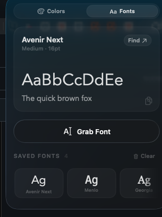

<div align="center">

# Picker

**A native macOS menu-bar color *and font* picker with Liquid Glass.**

Grab any pixel on screen as HEX / RGB / HSL / HSB — or click any text in any app to grab its font — and keep a palette and a font list of everything you've sampled.


<br>


&nbsp;&nbsp;


<br><br>


<sub><i>Grab Font reading a heading straight off a web page — family, weight, and size.</i></sub>

</div>

---

## What it does

Picker lives in your menu bar. Click it and you get two tools behind one glass panel:

- **Colors** — hit **Pick a Color** (or press **⌃⌥C**) and the displays freeze under a magnified loupe. Line up the exact pixel anywhere on screen and click; the color drops in as HEX / RGB / HSL / HSB (pick your preferred format in settings), ready to copy and saved to your palette.
- **Fonts** — hit **Grab Font** and your cursor becomes a text picker. Hover any text in **Safari or Chrome** (and other Chromium browsers), another app, or a dropdown — a crosshair highlights the exact run and reads its family and size — then click to keep it. The card shows a live specimen **in the font's real typeface** (downloading it if you don't already have it), and **Find** takes you to the font's source. A saved-fonts strip lets you flip between everything you've grabbed.

A sliding pill switches between the two; nothing else moves.

## Features

- **Magnified-pixel sampling** — a freeze loupe captures every display, then magnifies the frozen bitmap pixel-by-pixel so you grab the exact one every time. Requires **Screen Recording** permission (macOS prompts on first use). Adjust zoom with **−** / **=**, loupe size with **⌘−** / **⌘=**; from **8×** a pixel grid appears inside the loupe (toggle it off in settings if you prefer a clean magnifier).
- **Global pick shortcut** — default **⌃⌥C**; change it under the gear. Works even when another app is focused.
- **Grab any font, anywhere** — a click-through overlay reads the text *under* your cursor through the accessibility tree, so it works on web pages (Safari/WebKit **and Chrome/Chromium**), native apps, and even items in an already-open dropdown — highlighting the actual text run, never a surrounding box. Chromium hides the font family from accessibility, so for those browsers Picker reads it straight from the page's computed style — and the hover label resolves instantly.
- **Liquid Glass** — a real macOS 26 glass panel, not a mockup.
- **HEX · RGB · HSL · HSB** — every color format at once; choose which one the loupe and hero show via the gear; click a value to copy it and the icon flips to a checkmark.
- **Real-typeface specimen** — every grabbed font renders in its *actual* face. If you don't have it installed, Picker fetches and registers it on the fly from the open-font catalog (Google Fonts, then Fontsource), so the preview is the real thing — even for variable fonts that hide behind an odd internal name. Faces you can't legally download fall back to a system preview.
- **Find any font** — the **Find** link deep-links to a font's Google Fonts page when it's free, and otherwise opens a web search for the family name in Safari — so it locates commercial, foundry, and self-hosted fonts too, not just Google's catalog.
- **Saved palette & font list** — running strips of everything you've grabbed. Click to copy, hover to delete, scroll the row with your mouse wheel.
- **Readable on any color** — the text ink switches between black and white by perceived brightness, so the hex stays legible on reds, blues, and dark tones where naive luminance gets it wrong.
- **Out of the way** — no dock icon, no window clutter, one menu-bar click away.
- **Zero dependencies** — a single Swift package.

## Requirements

- macOS 26 (Tahoe) or later — Liquid Glass and the freeze loupe need the macOS 26 SDK
- Xcode 26 / Swift 6.2 to build
- **Pick a Color** needs **Screen Recording** permission (macOS prompts on first use)
- **Grab Font** needs Accessibility permission (macOS prompts on first use)
- **Grabbing fonts in Chrome/Chromium** also needs the browser to allow scripted access to the page: enable **View ▸ Developer ▸ Allow JavaScript from Apple Events** in Chrome, and grant Picker **Automation** access to the browser when prompted. Safari and native apps need neither.

## Build & run

```bash
git clone https://github.com/Entrepenulian/Picker.git
cd Picker
./build.sh            # compiles and assembles build/Picker.app
open build/Picker.app # launches the menu-bar agent
```

An eyedropper appears in your menu bar:

- **Left-click** it to open the panel.
- **Right-click** it to quit.

To make it Spotlight-launchable, drag `build/Picker.app` into `/Applications`.

> **Signing:** `build.sh` signs with a Developer ID identity when one is in your keychain (falling back to ad-hoc otherwise). A stable identity matters because **Accessibility** and **Screen Recording** grants are keyed to the app's signing identity — sign stably and you grant once, even across rebuilds; ad-hoc resets them every build.

## How it's built

Picker is a compact SwiftUI + AppKit app with no third-party code:

- **Shell** — a borderless, non-activating `NSPanel` anchored under an `NSStatusItem`, hosting SwiftUI through `NSHostingController`. Running its own panel instead of `MenuBarExtra` keeps the glass open *while* you sample.
- **Glass** — SwiftUI's `glassEffect` for the panel surface and the primary button.
- **Color sampling** — a freeze loupe via ScreenCaptureKit: one screenshot per display, then an opaque overlay that magnifies and labels the pixel under the cursor in the preferred format (HEX / RGB / HSL / HSB).
- **Font grabbing** — a full-screen, click-through, accessibility-invisible overlay plus a `CGEventTap` that *consumes* mouse events so the page underneath stays inert. A system-wide `AXUIElementCopyElementAtPosition` reads *through* the overlay and descends to the deepest `AXStaticText` leaf; the font comes from WebKit text-marker attributes, with a char-range fallback for native text.
- **Chromium support** — Chromium's accessibility hit test is unreliable (it returns a giant scroll container, not the run) and never reports the font family, so for Chromium browsers Picker finds the text run by **geometry** — the deepest `AXStaticText` whose frame contains the pointer, searched from the app root — and reads the actual family/size/weight from the page's `getComputedStyle` via an in-process `NSAppleScript` "execute javascript" call (~10ms, warmed at launch so the hover label is instant). It also wakes Chromium's lazily-built AX tree when the picker starts.
- **Real faces & Find** — when a grabbed font isn't installed, `FontLoader` pulls it from the Google Fonts **css2** catalog (or Fontsource on jsDelivr) and registers it with `CTFontManagerRegisterFontsForURL`, which loads TTF/WOFF/WOFF2 by content. Variable fonts that register under a named-instance family are remapped via the font's own descriptor so the specimen still renders. **Find** deep-links Google-hosted fonts and web-searches everything else.
- **Contrast** — ink chosen by YIQ perceived brightness (`0.299·R + 0.587·G + 0.114·B`), which keeps white text on saturated and dark colors.
- **Persistence** — the palette, font list, display format, loupe zoom, and pick shortcut are stored in `UserDefaults`.

```
Sources/Picker/
├── App.swift           # NSStatusItem + floating panel + sampling + font picking
├── PanelView.swift     # the whole UI: hero card, formats, palette, fonts section
├── Model.swift         # PickedColor, AppSettings, PickShortcut, color store
├── GlobalHotKey.swift  # Carbon RegisterEventHotKey for Pick a Color
├── Fonts.swift         # PickedFont and the font store
├── FontPicker.swift    # click-to-grab overlay (CGEventTap + accessibility reading)
├── FontLoader.swift    # downloads/registers real faces + Find URL routing
├── DesignSystem.swift  # tokens: ink, spacing, radii, motion
└── ColorSampler.swift  # freeze loupe (ScreenCaptureKit + overlay)
```

## License

MIT — see [LICENSE](LICENSE).
