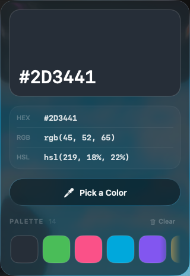

<div align="center">

# Picker

**A native macOS menu-bar color picker with Liquid Glass.**

Grab any pixel on screen, read it as HEX / RGB / HSL, and keep a palette of everything you've sampled.


<br>


&nbsp;&nbsp;


</div>

---

## What it does

Picker lives in your menu bar. Click it, hit **Pick a Color**, and your cursor becomes a magnified loupe — line up the exact pixel you want anywhere on screen and click. The color drops into the app instantly, ready to copy and saved to your palette.

## Features

- **Magnified-pixel sampling** — the native loupe magnifies the screen pixel-by-pixel, so you grab the exact one every time.
- **Liquid Glass** — a real macOS 26 glass panel, not a mockup.
- **HEX · RGB · HSL** — every format at once; click a value to copy it and the icon flips to a checkmark.
- **Saved palette** — a running strip of every color you grab. Click a chip to copy, hover to delete, scroll the row with your mouse wheel.
- **Readable on any color** — the text ink switches between black and white by perceived brightness, so the hex stays legible on reds, blues, and dark tones where naive luminance gets it wrong.
- **Out of the way** — no dock icon, no window clutter, one menu-bar click away.
- **Zero dependencies** — a single Swift package, ad-hoc signed.

## Requirements

- macOS 26 (Tahoe) or later — Liquid Glass and the loupe need the macOS 26 SDK
- Xcode 26 / Swift 6.2 to build

## Build & run

```bash
git clone https://github.com/Entrepenulian/Picker.git
cd Picker
./build.sh            # compiles and assembles build/Picker.app
open build/Picker.app # launches the menu-bar agent
```

An eyedropper appears in your menu bar:

- **Left-click** it to open the panel.
- **Right-click** it to quit.

To make it Spotlight-launchable, drag `build/Picker.app` into `/Applications`.

## How it's built

Picker is a compact SwiftUI + AppKit app with no third-party code:

- **Shell** — a borderless, non-activating `NSPanel` anchored under an `NSStatusItem`, hosting SwiftUI through `NSHostingController`. Running its own panel instead of `MenuBarExtra` keeps the glass open *while* you sample.
- **Glass** — SwiftUI's `glassEffect` for the panel surface and the primary button.
- **Sampling** — `NSColorSampler`, the same magnified loupe Apple's own color picker uses.
- **Contrast** — ink chosen by YIQ perceived brightness (`0.299·R + 0.587·G + 0.114·B`), which keeps white text on saturated and dark colors.
- **Persistence** — the palette is JSON in `UserDefaults`.

```
Sources/Picker/
├── App.swift           # NSStatusItem + floating panel + sampling
├── PanelView.swift     # the whole UI: hero card, formats, palette
├── Model.swift         # PickedColor, the store, color math
├── DesignSystem.swift  # tokens: ink, spacing, radii, motion
└── ColorSampler.swift  # NSColorSampler wrapper
```

## License

MIT — see [LICENSE](LICENSE).
